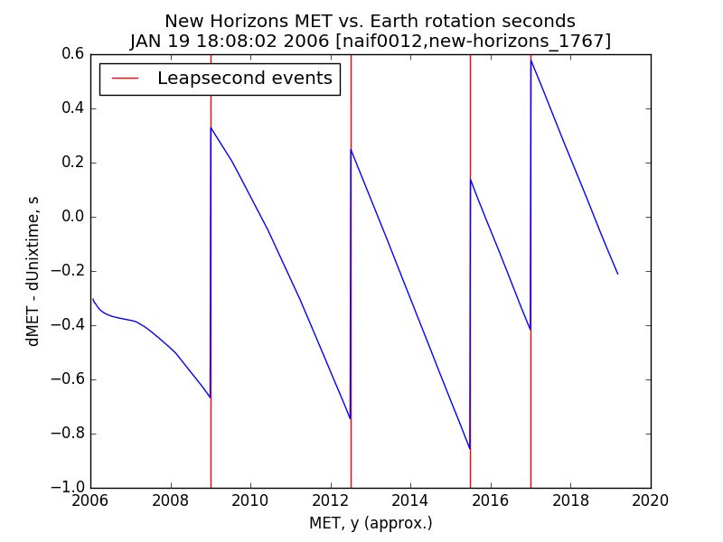
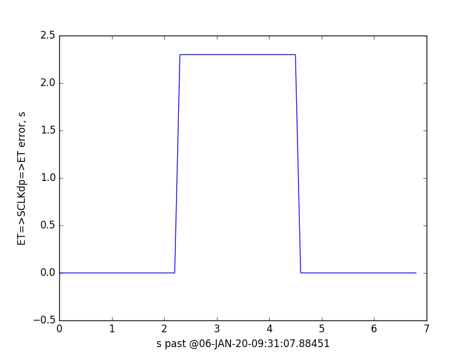

# nh_met_vs_earth

## Summary

The Unix(tm) time system, and indeed the built-in time systems for most computers, smartphones, etc., can be used to approximate the relationship between the New Horizons (NH) Mission Event/Elapsed Time (MET) and Coordinated Universal Time (UTC) to an accuracy of less than one second.

## Background

Coordinated Universal Time (UTC) is based on the Earth's rotation.  The time it takes Earth to make one mean synodic rotation is roughly 86,400.001 SI seconds; this is accounted for by adding leapseconds to UTC; one is added avery 2-3 years, on average, in recent times (2000 A.D. +/- 20h).

The NH MET loses about 1ms per day (86,400 MET seconds take 86,400.001 SI seconds).  The zero time is 2006-01-19T18:08:02 UTC (+0000), near the NH launch.

The Unix(tm) time system assumes one day is 86,400s and does not have an intrinsic correction for leapseconds; its zero time is 1970-01-01 00:00:00 +0000.

The result and benefit of this is that the sometimes cumbersome SPICE toolkit is not required to convert between NH MET and UTC for rough estimates (+/- 1s); simple applications using the native time sub-system common to most computers can perform the conversion.

## Application

The following commands use BASH shell syntax to convert a UTC to a NH MET, to an accuracy of +/-1s:

    % let met=$(date --date="2015-07-14 11:50:00 +0000" +%s)-$(date --date="2006-01-19 18:08:02 +0000" +%s) ; echo $met
    299180518

    % let met=$(date --date="2019-01-01 05:33:22 +0000" +%s)-$(date --date="2006-01-19 18:08:02 +0000" +%s) ; echo $met
    408626720

The reverse conversion is performed like this:

    % date --date="2006-01-19 18:08:02 +0000 + 299180518 seconds" --utc +%Y-%m-%dT%H:%M:%S
    2015-07-14T11:50:00

    % date --date="2006-01-19 18:08:02 +0000 + 408626720 seconds" --utc +%Y-%m-%dT%H:%M:%S
    2019-01-01T05:33:22

See below for validation and of these results and an explanation of these commands.

## Compare New Horizons NET to Earth rotation

The NH spacecraft clock loses about one SI millisecond per day, or just over 1s per 3y.

The Earth as a clock, as measured by its rotation and tracked by UTC, has one leapsecond added every few years.

As such, the NH clock (MET; Mission Elapsed Time) runs roughly in synchrony with Earth UTC sans leapseconds.

The script in this repository plots the difference between the NH MET with respect to a time near NH launch (19.January, 2006), and the corresponding non-leapsecond-corrected time, as implemented in the Python datetime module, with respect to that same time near launch.

The result shows that simple Unix-like time calculations time can be used to convert between NH MET and leapsecond-corrected UTC with an accuracy of around 1s.

## Validation of results

The following commands use the SPICE CHRONOS utility to make the same conversions

    % chronos -setup mk.tm -from utc -to sclk -time 2015-07-14T11:50:00
    3/0299180518:06211                                              (SCLK/SCLK)

    chronos -setup mk.tm -from utc -to sclk -time 2019-01-01T05:33:22
    3/0408626719:42579                                              (SCLK/SCLK)

The contents of the meta-kernel (MK) used in those CHRONOS commands, mk.tm:

    \begindata
    LEAPSECONDS_FILE = 'naif0012.tls'
    SCLK_FILE        = 'new-horizons_1767.tsc'
    SPACECRAFT_ID    = -98
    CENTER_ID        = -98
    \begintext

## Explanation of commands

See also the man page for date (e.g. [here](http://man7.org/linux/man-pages/man1/date.1.html).

For Chronos, see [CHRONOS User's Guide](https://naif.jpl.nasa.gov/pub/naif/utilities/PC_Linux_64bit/chronos.ug).

### UTC to NH MET

Here is the basic command to convert a UTC to NH MET:

    % let met=$(date --date="2019-01-01 05:33:22 +0000" +%s)-$(date --date="2006-01-19 18:08:02 +0000" +%s) ; echo $met

Working from the inside out:

- The date command, date --date="2019-01-01 05:33:22 +0000" +%s, takes calendar dates, in this case 2019-01-01 05:33:33 or 2006-01-19 18:08:02, interprets them as UTC via the +0000 timszone argument, and converts them to seconds past the Unix epoch, which is midnight on 01.January, 1970 UTC or 1970-01-01 00:00:00 +0000, via the command line option argument that defines the output format +%s.

- The $(command arg1 arg2 ...) syntax in the BASH shell runs the inner command, which is inside the parentheses, and replaces the entire $(command) portion of the outer command with that inner command's output.  So

    let met=$(date --date="2019-01-01 05:33:22 +0000" +%s)-$(date --date="2006-01-19 18:08:02 +0000" +%s)

becomes

    let met=1546320802-1137694082

- The let command, in this case now let met=1546320802-1137694082, is a BASH built-in that assigns the result of the arthmetic operation, 1546320802-1137694082, to the BASH variable met.

- The semi-colon is a BASH construct that allows putting a subsequent command, echo $met, on the same single command line

- The echo command writes its argument, $met, to standard ouput

- The $met argument de-references the BASH variable met, which in this case is the NH MET within 1s of the MET for leapsecond-corrected UTC 2019-01-01 05:33:22.

### MET to UTC

Here is the basic command to convert an NH MET to UTC:

    % date --date="2006-01-19 18:08:02 +0000 + 299180518 seconds" --utc +%Y-%m-%dT%H:%M:%S

- The date command starts with the NH MET zero epoch, --date="2006-01-19 18:08:02 +0000, and add a number of NH MET seconds, + 299180518 seconds"

- The --utc commnand line argument ensures the output of the date command is unaffected by any timezone settings local to the computer on which the command is being run.

- The output format is set via the command line option argument +%Y-%m-%dT%H:%M:%S:

  - Plus sign indicates this argument is an output format options
  - %Y => four-digit year
  - %m => two-digit month:  January is 01; December is 12.
  - %d => two-digit day of month
  - %H => two-digit hour of day
  - %M => two-digit minute of hour
  - %S => two-digit second of minute
  - Hyphens (-) and the letter T are passed through as-is.

- So this command

    date --date="2006-01-19 18:08:02 +0000 + 299180518 seconds" --utc +%Y-%m-%dT%H:%M:%S

becomes

    2015-07-14T11:50:00

## Two Seconds of Fudge

The NH MET epoch - the time NH MET is zero - in the the NH SCLK-Kernel file is @19-JAN-2006-18:09:05.184000, which is a Terrestrial Dynamic time (TDT; equivalent to Barycentric Dynamical Time, TDB for the purposes of this essay) at a time when there were 65.184 leapseconds between TDT and UTC, so the equvalent UTC is 2006-01-19T18:08:00.  That UTC value is incorrect, and the nh_met_vs_earth.py script corrects it to 2006-01-19T18:08:02 via a fudge factor two seconds.  The origin of that fudge factor is explained below, which explanation requires detailed understanding of the [SCLK system](https://naif.jpl.nasa.gov/pub/naif/toolkit_docs/C/req/sclk.html) of the NAIF/SPICE toolkit.

The reason for the fudge factor is that the first and second triplets for SCLK01_COEFFICIENTS_98 in NH SCLK-Kernels (new-horizons_VVVV.tsc, where VVVV is version number e.g. 1767) have an inconsistent relationship.  Specifically, the TDBseconds/METseconds slope from the first line does not represent the ratio between the TDB and tick values.  Operationally this is not an issue since this anomaly only shows up for a duration of about 2.3s at about 15h after the SCLK zero time.

The second script, nh_met_2s_anomaly.py, demonstrates that the difference between the first and second TDB values should be about 2.3s less than it is.  In addition it generates the plot below, which shows the result, near that brief period, of starting with an ET, converting it to an SCLK ticks value, and then back to an ET, which should be equal to the starting ET.

